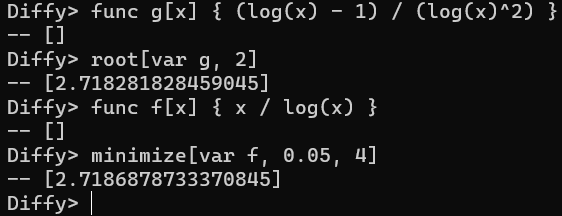

# Diffy
- Interpreted Lanuage with automated differentiation
- Implements automatic differentiation in forward mode using dual numbers, as well as symbolic approach
- Extended with numerical methods like Gradient Descent and Newton method

Refer to the image below for a glimpse of the syntax

